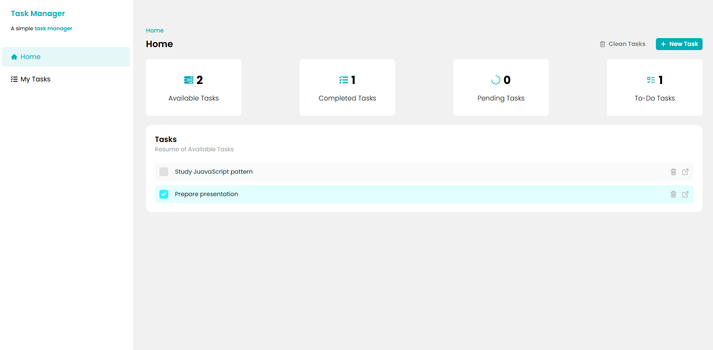
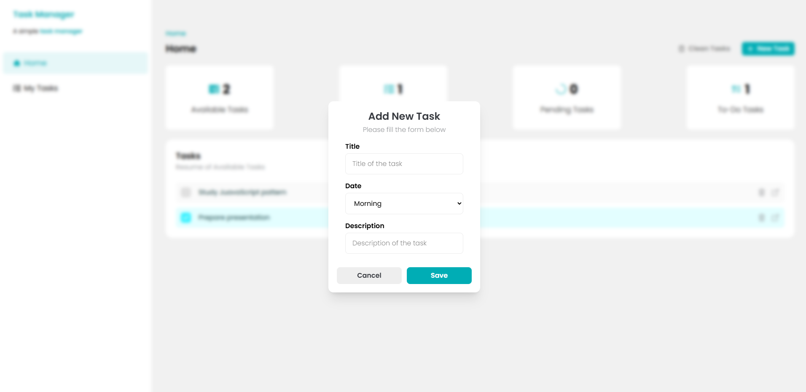
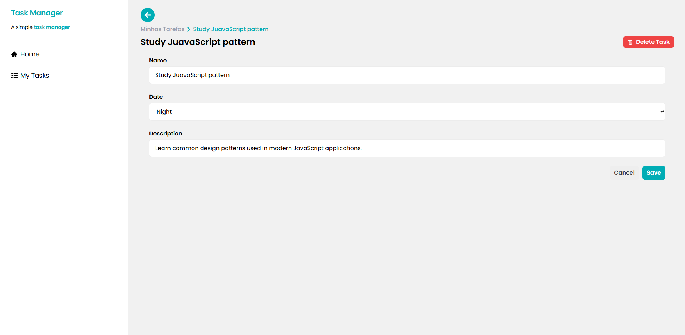

# 📦 How to Run the Project Locally

```bash
# Clone the repository
🔗 **Live Demo:** https://task-manager-react-six-rho.vercel.app
📂 **Repository:** git clone https://github.com/nicolasandreos/Task-Manager-React.git

# Navigate to the folder project
cd Task-Manager-React

# Install dependencies
npm install

# Run the application
npm run dev

# Run fake API
npx json-server --watch db.json --port 3000

---
# 📝 Task Manager

Web application for task management developed with React, consuming a simulated API (json-server).

The project was built with a focus on frontend architecture best practices, code organization, commit standardization, and separation of responsibilities.
```

---

## 📸 Preview

### 🏠 Home Screen


### ➕ Create Task


### ✏️ Edit Task


### 📌 Task List


## 🔗 API Repository

The simulated API was developed separately using json-server to replicate an independent backend environment.

📂 API RepositoryI: https://github.com/nicolasandreos/ToDoTasksReactAPI

## 🚀 Features

- ✅ Create tasks
- ✏️ Edit tasks
- 🗑️ Delete tasks
- 📋 List tasks
- 📌 Update task status
- 🔄 Automatic UI updates
- 📡 Simulated REST API consumption
- ⚙️ Loading state handling

---

## 🛠️ Technologies Used

### ⚛️ Frontend
- React
- Vite
- React Router DOM
- TailwindCSS
- Tailwind Variants
- Axios
- TanStack React Query
- React Hook Form

### 🗄️ Backend (Simulado)
- json-server

### 🧹Code Standardization & Quality
- ESLint
- Prettier
- Git Hooks (Husky + lint-staged)
- Conventional Commits

### 🚀 Deployment
- Vercel

---

## 🧠 Concepts and Architecture Applied

- Componentization and reusable components
- Responsibility-based project structure
- Custom hooks for HTTP requests
- Asynchronous state management with React Query
- Separation between service layer (API) and UI
- Form validation with React Hook Form
- Design System configuration (custom colors and typography in Tailwind)
- Automatic code formatting before commits
- Versioning following Conventional Commits

## 👨‍💻 Author

Developed by Nicolas Andreos
